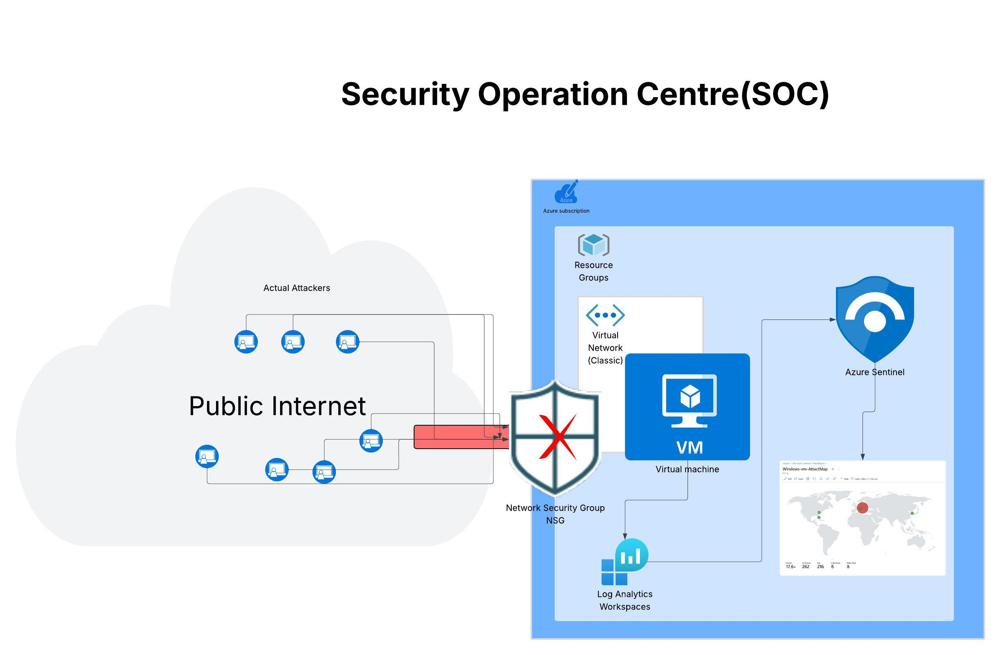
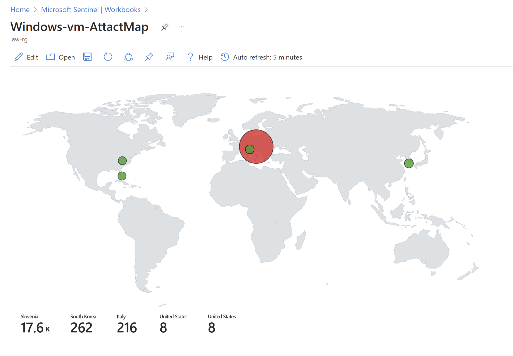

# 🌍 Honeypot Project – Global Threat Detection & SIEM Integration

## 🔍 Overview

This project demonstrates how to deploy a high-interaction honeypot to simulate vulnerable services, monitor malicious login attempts, and visualize the source of these attacks in real time using Microsoft Sentinel Workbooks. The honeypot is configured to capture and log suspicious activities, which are then analyzed and visualized through Microsoft Sentinel for enhanced threat detection.
It's designed to help you explore:

- Attack behavior in the wild
- Log collection and threat detection with Sentinel
- Enriching logs with location data (GeoIP)
- Building insightful visualizations with KQL and Sentinel Workbooks

---

## ⚙️ Key Features

✅ Deploy a vulnerable Windows VM honeypot  
✅ Stream Windows Security Events into Azure Sentinel  
✅ Detect failed login attempts via KQL  
✅ Enrich data with **GeoIP Watchlists**  
✅ Visualize attacks on a world map using Sentinel Workbooks  
✅ Learn SIEM fundamentals hands-on

---

## 💻 Technologies Used

- **Microsoft Azure** – Cloud infrastructure provider
- **Azure Sentinel** – Cloud-native SIEM & SOAR platform
- **Kusto Query Language (KQL)** – For querying and analyzing security logs
- **GeoLite2** – GeoIP data source (summarized version)
- **Sentinel Workbooks** – For interactive dashboards and visualization
- **Windows 10 VM** – Honeypot target

---


## 📂 Project Structure

```plaintext
Azure-Sentinel-Honeypot-Project/
├── README.md               # Project overview, instructions, and setup guide
├── sentinel-workbook/       # Contains JSON file for creating the Attack Map in Azure Sentinel
│   └── attack-map.json      # JSON configuration for the Attack Map Workbook
├── watchlist/               # Watchlist data for geo-location enrichment in Azure Sentinel
│   └── geoip-summarized.csv # GeoIP watchlist to enrich event logs with geographic data
├── screenshots/             # Visual representations of the project setup and results
│   └── attack-map-sample.png # Screenshot of the generated Attack Map in Azure Sentinel
└── setup-guide/             # Detailed instructions for setting up and replicating the project
    └── steps.md             # Step-by-step guide for deploying and configuring the honeypot
```

## 🧭 Architecture

This diagram outlines the data flow and services used in the Azure Honeypot AttackMap project:



**How It Works:**

1. **VM Deployment**: A Windows 10 VM acts as a decoy (honeypot).
2. **Security Logging**: Failed login attempts are captured as `EventID 4625`.
3. **Log Analytics Workspace (LAW)**: Events are streamed into Sentinel via LAW.
4. **GeoIP Watchlist**: Enriches IP data with geolocation info.
5. **Sentinel Workbook**: KQL queries pull enriched logs and render the attack map.

---
## 📈 24-Hour Threat Snapshot

Over the course of **24 hours**, the honeypot recorded **18,086+ failed login attempts** and other suspicious activities from global locations:

- 🇸🇮 **Slovenia** – **17,600+ events**
- 🇰🇷 **South Korea** – **262 events**
- 🇮🇹 **Italy** – **216 events**
- 🇺🇸 **United States** – **8 events**

These logs were enriched with **GeoIP data**, enabling detailed geographical analysis of attack sources.

### Visual Results

The **heatmap** below shows the geographical locations of the failed login attempts and suspicious activities.

1. **Attack Map Visualization:**

   

   This heatmap shows the geographical locations of the failed login attempts and other suspicious activity.

### Key Insights

- **Geo-location Insights**: The **GeoIP enrichment** allows for precise identification of the geographical regions from which attacks originate, helping security teams focus on specific threat vectors.
- **Security Monitoring**: The setup of this honeypot and its integration with **Azure Sentinel** provides continuous monitoring of suspicious activities, making it a useful tool for security operations in real-world environments.
- **Actionable Data**: With **KQL queries**, you can further drill into the logs, filter results, and identify suspicious patterns, making this project a learning tool for analyzing and responding to security threats.

---

## Getting Started
To replicate this project, follow the summarized setup steps below or refer to the full setup guide in `setup-guide/steps.md`:

1. Create an Azure account and set up a VM.
2. Configure Azure Sentinel and connect the VM.
3. Import the GeoIP Watchlist into Sentinel.
4. Use the provided workbook for attack location visualization.

For detailed instructions, please refer to the [Setup Guide](setup/azure-setup-guide.md).


---

## Sentinel Attack Map Query

This KQL query detects failed login attempts on your Azure Sentinel workspace and visualizes them using a geographic map based on GeoIP data. The query helps you identify patterns in login attempts across various locations globally.

### Query Breakdown
- **Failed Logins**: The query tracks failed login attempts (EventID 4625) from various IP addresses.
- **GeoIP Enrichment**: The IP addresses are enriched with geographic data using the GeoIP watchlist, allowing the visualization of attack origins on the map.
- **Map Visualization**: The final result is displayed on a map, using geographic coordinates (latitude and longitude) derived from the enriched data.

### How to Use

1. Navigate to **Azure Sentinel Workbooks** in your Azure Portal.
2. Click on **+ New** to create a new **Workbook**.
3. Add a **Query** to the workbook and paste the following KQL query from the `workbooks/attack-map.json` file.
4. Configure the **Map Visualization**:
   - Set the **Latitude** and **Longitude** fields from the query results.
   - Adjust settings like **opacity**, **size settings**, and **color settings** as necessary.
5. Save the workbook with an appropriate name.

